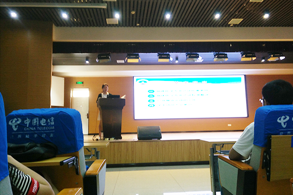
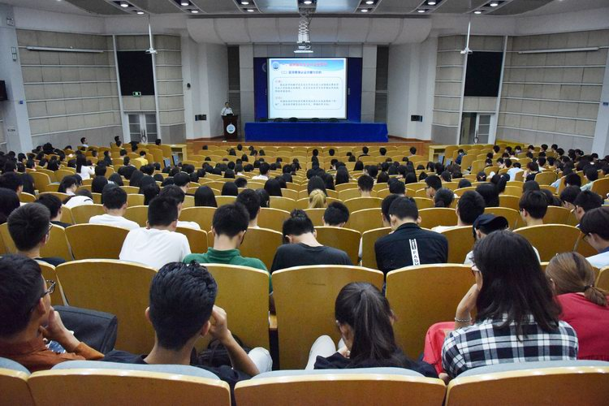
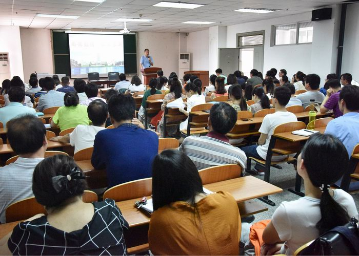
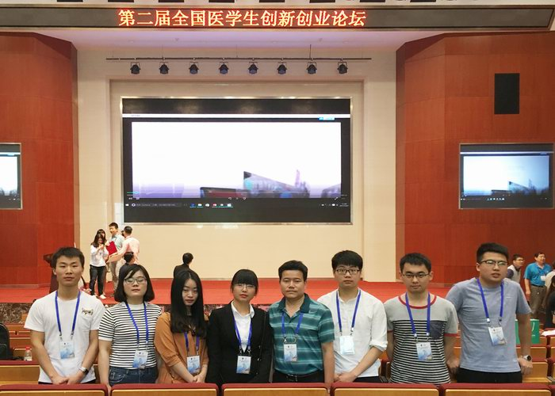

图片轮播特效
====
#html部分  
##开头的引例

···
<!DOCTYPE html>
<html lang="en">
<head>
    <meta charset="utf-8">
    <title></title>
    <link href="css1.css" rel="stylesheet" type="text/css"/>
    <script type="text/javascript" src="js1.js"></script>
    <style>
    </style>
</head>
<body>
</body>
</html>
···

##主体  
###通过几个盒子来包括图片、原点和大小余号  

```
<div id="a01">
        <div id="a02" style="left: -600px;">
            
            
            
            
            
            
            
        </div>
        <div id="a03">
            <span class="on"></span>
            <span ></span>
            <span ></span>
            <span ></span>
            <span ></span>
        </div>
            <a href="javascript:;" id="shang" class="a04">&lt;</a>
            <a href="javascript:;" id="xia" class="a04">&gt;</a>
</div>
```

---

#css部分  
##需要注意的内容  
1.z-index:堆叠的层，数字越大代表层越外，  

```
#a02{
    position: absolute;
    z-index: 1;
    width: 4200px;
    height: 400px;
}
#a03{
    position: absolute;
    left: 250px;
    bottom: 20px;
    z-index: 2;
    height: 10px;
    width: 100px;
}
```

2.border-radius：将事物设置成圆形  
3.cursor:将鼠标的光标设置成移到事物上的时候变成别的样子  
4.*关于无缝连接*  
由于从最后一张切图回到第一张时会有很大的空白，则复制第五张图到第一张图前面，复制第一张图到第五张图后面，并且将放在第一张图前面的第五张图隐藏起来，设置style="left:-600px;"  

```
<div id="a02" style="left: -600px;">
```

6.*关于只显示一张图片*  
每次播放一张图片，其余图片都隐藏起来  

```
csss: overflow: hidden;
```
---

#js部分  
##具体步骤  
###前提  
1.每个图片的长度都为600px，宽度为400px，  
2.用var定义变量引用html中的对象  
###定义函数  
1.animate(offset)这是定义一个函数让图片能够左右移动  
2.parseInt()让一个对象能够已数字的形式表现，换句话说就是你能通过一个数字来得到这个对象  

```
function animate(offset){
        var newLeft=parseInt(a02.style.left)+offset;
        a02.style.left=newLeft+'px';
        if(newLeft<-3000){
            a02.style.left=-600+'px';
        }
        if(newLeft>-600){
            a02.style.left=-3000+'px';
        }
    }
    shang.onclick=function(){
        animate(600);
    }
    xia.onclick=function(){
        animate(-600);
    }
```

3.play()定义一个函数来当做定时器，可以让图片自动播放  
而setInterval()就是让连续定时播放；a01.onmouseout=play则是让鼠标从a01上移开是运行play()函数  

```
var timer;
function play(){
        timer=setInterval(function(){
            shang.onclick()
        },1500);

a01.onmouseout=play;
```

4.stop()就是消除setInterval()的影响，而a01.onmouseover=stop;则是让鼠标移到a01时运行stop()函数  

```
function stop(){
        clearInterval(timer);
    }

 a01.onmouseover=stop;
```
